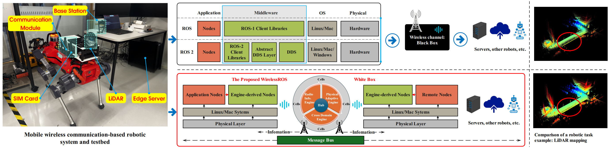

# WirelessROS (Implementation Details are in the [details.md](./details.md) File)
### Code link: https://github.com/WirelessROS/WirelessROS
### If you encounter any issues during installation or running, please open an issue, and I will respond within one day.

## An Open Source Wireless-Native Robot Operating System

WirelessROS is a revolutionary framework that transforms wireless communication from a traditional external module into a transparent core resource within the robot operating system. It enables unprecedented capabilities including communication quality awareness, cross-domain knowledge fusion, and dynamic resource allocation, surpassing functionalities available in current ROS-based systems.



## Features

- **Native Cellular Integration**: First open-source robot operating system with native integration for mobile communication
- **Physical Layer Access**: Direct exposure of PHY-layer metrics for real-time adaptation
- **Cross-Domain Fusion**: Seamless integration between communication and robotic domains
- **Dynamic Resource Allocation**: Intelligent allocation of communication resources based on task requirements
- **Adaptive QoS Management**: Task-aware quality of service optimization

## System Architecture

WirelessROS is built upon the **Hub-Engines-Cells (HEC)** architecture:

### Hub
The central coordination entity responsible for orchestrating global policies, service mesh management, and domain context integration.

### Engines
Specialized cross-domain processors:
- **Radio Information Engine**: Extracts and translates PHY/MAC metrics
- **Cross Domain Engine**: Bridges communication insights with robotic tasks
- **Physical Adaptive Engine**: Optimizes transmission parameters and resource allocation

### Cells
Distributed functional units implementing domain-specific operations (sensors, communication stack, planning, etc.)

## Installation

### Prerequisites

- Ubuntu 20.04 LTS or higher
- Python 3.8+
- CMake 3.10+
- g++ 9.3.0+
- InfluxDB 2.0+
- ZeroMQ libraries

### Installing ROS Noetic

```bash
# Setup sources.list
sudo sh -c 'echo "deb http://packages.ros.org/ros/ubuntu $(lsb_release -sc) main" > /etc/apt/sources.list.d/ros-latest.list'

# Setup keys
sudo apt install curl -y
curl -s https://raw.githubusercontent.com/ros/rosdistro/master/ros.asc | sudo apt-key add -

# Update package index
sudo apt update

# Install ROS Noetic (Desktop Full)
sudo apt install ros-noetic-desktop-full -y

# Initialize rosdep
sudo apt install python3-rosdep -y
sudo rosdep init
rosdep update

# Environment setup
echo "source /opt/ros/noetic/setup.bash" >> ~/.bashrc
source ~/.bashrc

# Install dependencies for building packages
sudo apt install python3-rosinstall python3-rosinstall-generator python3-wstool build-essential -y
```

### Installing ROS 2 Humble (Ubuntu 22.04)

```bash
# Locale settings
sudo apt update && sudo apt install locales -y
sudo locale-gen en_US en_US.UTF-8
sudo update-locale LC_ALL=en_US.UTF-8 LANG=en_US.UTF-8
export LANG=en_US.UTF-8

# Setup sources
sudo apt install software-properties-common -y
sudo add-apt-repository universe -y

# Add ROS 2 GPG key
sudo apt update && sudo apt install curl -y
sudo curl -sSL https://raw.githubusercontent.com/ros/rosdistro/master/ros.key -o /usr/share/keyrings/ros-archive-keyring.gpg

# Add repository to sources list
echo "deb [arch=$(dpkg --print-architecture) signed-by=/usr/share/keyrings/ros-archive-keyring.gpg] http://packages.ros.org/ros2/ubuntu $(. /etc/os-release && echo $UBUNTU_CODENAME) main" | sudo tee /etc/apt/sources.list.d/ros2.list > /dev/null

# Update and install ROS 2 Humble
sudo apt update
sudo apt install ros-humble-desktop -y

# Install development tools
sudo apt install ros-dev-tools -y

# Environment setup
echo "source /opt/ros/humble/setup.bash" >> ~/.bashrc
source ~/.bashrc
```

### Installing WirelessROS

```bash
# Clone the repository
git clone https://github.com/your-org/wireless-ros.git
cd wireless-ros

# Build the workspace
mkdir -p build && cd build
cmake ..
make -j4

# Install the package
sudo make install

# Set up Python environment
pip install -r requirements.txt
```

### Setting up the Wireless Communication Layer

WirelessROS requires a cellular communication layer for full functionality. Follow these steps to install and configure the mobile communication stack:

```bash
# Clone the communication layer repository
git clone https://github.com/your-org/wireless-stack.git
cd wireless-stack

# Install dependencies
sudo apt-get update
sudo apt-get install -y build-essential cmake libsctp-dev lksctp-tools libfftw3-dev libconfig++-dev libboost-all-dev

# Build the communication stack
mkdir -p build && cd build
cmake ..
make -j4
sudo make install

# Configure the mobile communication stack
cd ../config
cp default_config.conf ~/wireless_ros_config.conf

# Edit the configuration file as needed
nano ~/wireless_ros_config.conf
```

## Configuration

### InfluxDB Setup

WirelessROS uses InfluxDB to store and query communication metrics:

```bash
# Start InfluxDB service
sudo systemctl start influxdb

# Create a bucket and token for WirelessROS
influx setup \
  --username wirelessros_admin \
  --password secure_password \
  --org my_org \
  --bucket my_bucket \
  --force

# Retrieve the token (you'll need this for configuration)
influx auth list
```

### WirelessROS Configuration

Edit the main configuration file to set up your system:

```bash
# Create and edit the configuration file
mkdir -p ~/.wireless_ros
cp config/wireless_ros.yaml ~/.wireless_ros/

# Edit the configuration
nano ~/.wireless_ros/wireless_ros.yaml
```

Key configuration parameters:

```yaml
influxdb:
  url: "http://localhost:8086"
  token: "YOUR_INFLUX_TOKEN"
  org: "my_org"
  bucket: "my_bucket"

engines:
  radio_info_engine:
    measurement_interval: 0.1
    prediction_enabled: true
    anomaly_detection_enabled: true
  
  cross_domain_engine:
    update_interval: 0.2
    enable_map_enhancement: true
    enable_path_optimization: true
  
  physical_adaptive_engine:
    update_interval: 0.1
    learning_rate: 0.1
    exploration_rate: 0.2
    enable_adaptive_harq: true
    
hub:
  check_interval: 1.0
  recovery_enabled: true
  resource_conflict_resolution: true
```

## Usage

### Launch the WirelessROS System

Use the provided launch file to start the system:

```bash
# Using ROS launch
roslaunch wireless_ros wireless_ros.launch

# Or using ROS2
ros2 launch wireless_ros wireless_ros.launch.py
```

### Running the Three Engines

You can also start each engine individually:

```bash
# Start the Radio Information Engine
rosrun wireless_ros radio_information_engine.py

# Start the Cross Domain Engine
rosrun wireless_ros cross_domain_engine.py

# Start the Physical Adaptive Engine
rosrun wireless_ros physical_adaptive_engine.py
```

### Using the Hub

The Hub can be started separately to orchestrate the system:

```bash
rosrun wireless_ros hub.py
```

## Examples

### Example 1: Communication-Aware Visual Robot

This example demonstrates a robot that dynamically adjusts its vision processing based on communication quality:

```python
#!/usr/bin/env python3
from wireless_ros import Hub, RadioInfoEngine, CrossDomainEngine, PhysicalAdaptiveEngine, SensorCell, CommCell, AdaptivePolicy, QoSProfile
from wireless_ros.core import ChannelObserver
import rospy
from sensor_msgs.msg import Image
import numpy as np

class RobotNode(ChannelObserver):
    def __init__(self):
        self.hub = Hub()
        self.rie = self.hub.attach_engine(RadioInfoEngine(), mode='realtime') 
        self.cde = self.hub.attach_engine(CrossDomainEngine(), mode='optimized')
        self.pae = self.hub.attach_engine(PhysicalAdaptiveEngine(), mode='burst')
        self.camera_cell = self.hub.deploy_cell(SensorCell, "front_cam")
        self.camera_cell.configure(AdaptivePolicy(QoSProfile.HIGH_RES))
        self._deploy_comm_stack()
        rospy.Subscriber("/camera/image", Image, self._image_callback)
        self.rie.register_observer(self)
        
        # Image publisher for processed images
        self.image_pub = rospy.Publisher('/wireless_ros/processed_image', Image, queue_size=10)
        
        # Current network quality state
        self.network_quality = "GOOD"
        
        rospy.loginfo("Communication-aware visual robot initialized")
    
    def on_channel_update(self, state):
        # Update network quality assessment
        if state.pusch_snr > 25 and state.dl_bler < 0.01:
            self.network_quality = "EXCELLENT"
        elif state.pusch_snr > 15 and state.dl_bler < 0.05:
            self.network_quality = "GOOD"
        elif state.pusch_snr > 10 and state.dl_bler < 0.1:
            self.network_quality = "FAIR"
        else:
            self.network_quality = "POOR"
            
        rospy.loginfo(f"Network quality: {self.network_quality}, SNR: {state.pusch_snr}, BLER: {state.dl_bler}")
        
        # Generate transmission strategy based on channel state
        strategy = self.pae.optimize_transmission(
            snr=state.snr, 
            prb_util=state.prb_util, 
            qos_requirement=self.camera_cell.current_qos
        )
        self.cde.convert_to_constraints(strategy)
    
    def _deploy_comm_stack(self):
        self.phy_cell = self.hub.deploy_cell(CommCell, "phy_layer", layer='phy')
        self.mac_cell = self.hub.deploy_cell(CommCell, "mac_layer", layer='mac')
        self.phy_cell.bind_parameter('mcs', lambda: self.pae.current_mcs)
        self.mac_cell.bind_parameter('harq', lambda: self.rie.harq_status)
    
    def _image_callback(self, msg):
        # Process image based on network quality
        if self.network_quality == "EXCELLENT":
            # Process at full resolution
            processed_msg = self._process_full_res(msg)
        elif self.network_quality == "GOOD":
            # Process at high resolution with some compression
            processed_msg = self._process_high_res(msg)
        elif self.network_quality == "FAIR":
            # Process at medium resolution
            processed_msg = self._process_medium_res(msg)
        else:
            # Process at low resolution
            processed_msg = self._process_low_res(msg)
            
        # Publish processed image
        self.image_pub.publish(processed_msg)
        
        # Apply constraints from Cross Domain Engine
        self.camera_cell.ingest_ros_message(msg)
        if self.cde.current_constraints:
            self.camera_cell.apply_constraints(self.cde.current_constraints)
    
    def _process_full_res(self, msg):
        # Full resolution processing
        rospy.loginfo("Processing at FULL resolution")
        return msg
    
    def _process_high_res(self, msg):
        # High resolution processing with some compression
        rospy.loginfo("Processing at HIGH resolution")
        # In a real implementation, this would resize or compress the image
        return msg
    
    def _process_medium_res(self, msg):
        # Medium resolution processing
        rospy.loginfo("Processing at MEDIUM resolution")
        # In a real implementation, this would resize or compress the image more
        return msg
    
    def _process_low_res(self, msg):
        # Low resolution processing
        rospy.loginfo("Processing at LOW resolution")
        # In a real implementation, this would significantly resize or compress the image
        return msg

if __name__ == '__main__':
    rospy.init_node('communication_aware_vision_node')
    node = RobotNode()
    rospy.spin()
```

### Example 2: LiDAR-based Perception with Adaptive Transmission

This example shows how to integrate WirelessROS with a LiDAR sensor for adaptive point cloud processing:

```python
#!/usr/bin/env python3
from wireless_ros import Hub, RadioInfoEngine, CrossDomainEngine, PhysicalAdaptiveEngine, SensorCell, CommCell, AdaptivePolicy, QoSProfile
from wireless_ros.core import ChannelObserver
import rospy
from sensor_msgs.msg import PointCloud2
import std_msgs.msg

class LidarProcessor(ChannelObserver):
    def __init__(self):
        # Initialize WirelessROS components
        self.hub = Hub()
        self.rie = self.hub.attach_engine(RadioInfoEngine(), mode='realtime')
        self.cde = self.hub.attach_engine(CrossDomainEngine(), mode='optimized')
        self.pae = self.hub.attach_engine(PhysicalAdaptiveEngine(), mode='burst')
        
        # Deploy cells
        self.lidar_cell = self.hub.deploy_cell(SensorCell, "lidar_sensor")
        self.lidar_cell.configure(AdaptivePolicy(QoSProfile.HIGH_THROUGHPUT))
        
        # Communication stack
        self.phy_cell = self.hub.deploy_cell(CommCell, "phy_layer", layer='phy')
        self.mac_cell = self.hub.deploy_cell(CommCell, "mac_layer", layer='mac')
        
        # Parameter binding
        self.phy_cell.bind_parameter('mcs', lambda: self.pae.current_mcs)
        self.mac_cell.bind_parameter('harq', lambda: self.rie.harq_status)
        
        # Register for channel updates
        self.rie.register_observer(self)
        
        # Subscribers and publishers
        self.pc_sub = rospy.Subscriber('/lidar/points', PointCloud2, self.lidar_callback)
        self.pc_pub = rospy.Publisher('/wireless_ros/processed_pointcloud', PointCloud2, queue_size=10)
        self.status_pub = rospy.Publisher('/wireless_ros/lidar_status', std_msgs.msg.String, queue_size=10)
        
        # State variables
        self.downsampling_factor = 1.0  # No downsampling by default
        self.channel_quality = 1.0  # Perfect quality by default
        
        rospy.loginfo("LiDAR processor initialized with WirelessROS")
    
    def on_channel_update(self, state):
        """Handle wireless channel state updates"""
        # Calculate channel quality (0.0-1.0)
        snr_quality = min(1.0, state.pusch_snr / 30.0)  # Normalize SNR
        bler_quality = max(0.0, 1.0 - state.dl_bler * 10)  # Higher BLER = lower quality
        
        # Combine factors (you might want to weight these differently)
        self.channel_quality = 0.7 * snr_quality + 0.3 * bler_quality
        
        # Update downsampling factor based on channel quality
        if self.channel_quality > 0.8:
            self.downsampling_factor = 1.0  # Full resolution
        elif self.channel_quality > 0.6:
            self.downsampling_factor = 0.75  # 75% of points
        elif self.channel_quality > 0.4:
            self.downsampling_factor = 0.5  # Half of points
        elif self.channel_quality > 0.2:
            self.downsampling_factor = 0.25  # 25% of points
        else:
            self.downsampling_factor = 0.1  # Minimum resolution
        
        # Generate and apply transmission strategy
        strategy = self.pae.optimize_transmission(
            snr=state.snr,
            prb_util=state.prb_util,
            qos_requirement=self.lidar_cell.current_qos
        )
        self.cde.convert_to_constraints(strategy)
        
        # Publish status update
        status_msg = std_msgs.msg.String()
        status_msg.data = f"Channel quality: {self.channel_quality:.2f}, Downsampling: {self.downsampling_factor:.2f}"
        self.status_pub.publish(status_msg)
        
        rospy.loginfo(f"Channel update: SNR={state.pusch_snr}, BLER={state.dl_bler}, Quality={self.channel_quality:.2f}")
    
    def lidar_callback(self, point_cloud_msg):
        """Process incoming point cloud data"""
        # In a real implementation, you would downsample the point cloud
        # based on self.downsampling_factor
        
        # This is a simplified example that just passes through the message
        # In practice, you would use PCL or similar to process the point cloud
        processed_msg = point_cloud_msg
        
        # Add header information about processing
        processed_msg.header.frame_id = point_cloud_msg.header.frame_id
        processed_msg.header.stamp = rospy.Time.now()
        
        # Publish processed point cloud
        self.pc_pub.publish(processed_msg)
        
        # Ingest original message into the cell for monitoring
        self.lidar_cell.ingest_ros_message(point_cloud_msg)
        
        # Apply any constraints from Cross Domain Engine
        if self.cde.current_constraints:
            self.lidar_cell.apply_constraints(self.cde.current_constraints)
        
        rospy.logdebug(f"Processed point cloud with downsampling factor: {self.downsampling_factor}")

if __name__ == '__main__':
    rospy.init_node('wireless_lidar_processor')
    node = LidarProcessor()
    rospy.spin()
```

### Example 3: Multi-sensor Navigation with Communication Awareness

This example demonstrates a more complex robot setup with multiple sensors and communication-aware navigation:

```python
#!/usr/bin/env python3
from wireless_ros import Hub, RadioInfoEngine, CrossDomainEngine, PhysicalAdaptiveEngine
from wireless_ros import SensorCell, CommCell, AdaptivePolicy, QoSProfile
from wireless_ros.core import ChannelObserver
import rospy
import numpy as np
from sensor_msgs.msg import Image, PointCloud2, NavSatFix
from nav_msgs.msg import Path, OccupancyGrid
from geometry_msgs.msg import PoseStamped, Twist

class NavigationRobot(ChannelObserver):
    def __init__(self):
        # Initialize WirelessROS hub and engines
        self.hub = Hub()
        self.rie = self.hub.attach_engine(RadioInfoEngine(), mode='realtime')
        self.cde = self.hub.attach_engine(CrossDomainEngine(), mode='optimized')
        self.pae = self.hub.attach_engine(PhysicalAdaptiveEngine(), mode='burst')
        
        # Deploy sensor cells
        self.camera_cell = self.hub.deploy_cell(SensorCell, "front_camera")
        self.camera_cell.configure(AdaptivePolicy(QoSProfile.MEDIUM_RES))
        
        self.lidar_cell = self.hub.deploy_cell(SensorCell, "lidar")
        self.lidar_cell.configure(AdaptivePolicy(QoSProfile.HIGH_THROUGHPUT))
        
        self.gps_cell = self.hub.deploy_cell(SensorCell, "gps")
        self.gps_cell.configure(AdaptivePolicy(QoSProfile.RELIABLE))
        
        # Deploy communication stack
        self.phy_cell = self.hub.deploy_cell(CommCell, "phy_layer", layer='phy')
        self.mac_cell = self.hub.deploy_cell(CommCell, "mac_layer", layer='mac')
        self.pdcp_cell = self.hub.deploy_cell(CommCell, "pdcp_layer", layer='pdcp')
        
        # Bind parameters
        self.phy_cell.bind_parameter('mcs', lambda: self.pae.current_mcs)
        self.mac_cell.bind_parameter('harq', lambda: self.rie.harq_status)
        self.pdcp_cell.bind_parameter('compression', lambda: self.pae.compression_ratio)
        
        # Subscribe to sensor topics
        rospy.Subscriber('/camera/image_raw', Image, self.camera_callback)
        rospy.Subscriber('/lidar/points', PointCloud2, self.lidar_callback)
        rospy.Subscriber('/gps/fix', NavSatFix, self.gps_callback)
        
        # Navigation-related subscribers and publishers
        rospy.Subscriber('/map', OccupancyGrid, self.map_callback)
        self.path_pub = rospy.Publisher('/wireless_ros/comm_aware_path', Path, queue_size=1)
        self.cmd_vel_pub = rospy.Publisher('/cmd_vel', Twist, queue_size=10)
        
        # Network quality mapping
        self.network_quality_map = None  # Will be initialized when map is received
        self.pose_history = []
        self.network_quality_history = []
        
        # Register with Radio Information Engine
        self.rie.register_observer(self)
        
        # Navigation state
        self.current_pose = None
        self.current_path = None
        self.network_quality = "UNKNOWN"
        self.communication_critical = False  # Flag for communication-critical operations
        
        rospy.loginfo("Communication-aware navigation robot initialized")
    
    def on_channel_update(self, state):
        """Process channel state updates from Radio Information Engine"""
        # Update network quality assessment
        if state.pusch_snr > 25 and state.dl_bler < 0.01:
            quality = "EXCELLENT"
        elif state.pusch_snr > 15 and state.dl_bler < 0.05:
            quality = "GOOD"
        elif state.pusch_snr > 10 and state.dl_bler < 0.1:
            quality = "FAIR"
        else:
            quality = "POOR"
        
        # Only log if quality changed
        if quality != self.network_quality:
            rospy.loginfo(f"Network quality changed: {self.network_quality} -> {quality}")
            self.network_quality = quality
        
        # Generate transmission strategy
        strategy = self.pae.optimize_transmission(
            snr=state.snr,
            prb_util=state.prb_util,
            qos_requirement=self.get_current_qos_requirement()
        )
        
        # Convert strategy to constraints
        self.cde.convert_to_constraints(strategy)
        
        # Update network quality map if we have a pose
        if self.current_pose and self.network_quality_map is not None:
            pos_x = self.current_pose.pose.position.x
            pos_y = self.current_pose.pose.position.y
            self.update_network_quality_map(pos_x, pos_y, state.pusch_snr)
    
    def get_current_qos_requirement(self):
        """Determine current QoS requirements based on robot state"""
        if self.communication_critical:
            return QoSProfile.ULTRA_RELIABLE
        
        # Otherwise base it on active sensors and tasks
        if self.current_path and len(self.current_path.poses) > 0:
            return QoSProfile.HIGH_THROUGHPUT
        
        return QoSProfile.BALANCED
    
    def camera_callback(self, msg):
        """Process camera data"""
        self.camera_cell.ingest_ros_message(msg)
        if self.cde.current_constraints:
            self.camera_cell.apply_constraints(self.cde.current_constraints)
    
    def lidar_callback(self, msg):
        """Process LiDAR data"""
        self.lidar_cell.ingest_ros_message(msg)
        if self.cde.current_constraints:
            self.lidar_cell.apply_constraints(self.cde.current_constraints)
    
    def gps_callback(self, msg):
        """Process GPS data"""
        self.gps_cell.ingest_ros_message(msg)
        if self.cde.current_constraints:
            self.gps_cell.apply_constraints(self.cde.current_constraints)
    
    def map_callback(self, msg):
        """Process map data and initialize network quality map"""
        if self.network_quality_map is None:
            rospy.loginfo("Initializing network quality map")
            # Create a map of the same dimensions to store network quality
            width = msg.info.width
            height = msg.info.height
            resolution = msg.info.resolution
            origin_x = msg.info.origin.position.x
            origin_y = msg.info.origin.position.y
            
            self.network_quality_map = {
                'width': width,
                'height': height,
                'resolution': resolution,
                'origin_x': origin_x,
                'origin_y': origin_y,
                'data': np.full((height, width), -1.0)  # -1 means unknown quality
            }
            
            rospy.loginfo(f"Network quality map initialized: {width}x{height} cells")
    
    def update_network_quality_map(self, x, y, snr):
        """Update network quality map at the given position"""
        if not self.network_quality_map:
            return
        
        # Convert world coordinates to map coordinates
        map_x = int((x - self.network_quality_map['origin_x']) / self.network_quality_map['resolution'])
        map_y = int((y - self.network_quality_map['origin_y']) / self.network_quality_map['resolution'])
        
        # Check if coordinates are within map bounds
        if (0 <= map_x < self.network_quality_map['width'] and 
            0 <= map_y < self.network_quality_map['height']):
            
            # Normalize SNR to 0-1 range (assuming 30dB is max)
            normalized_snr = max(0.0, min(1.0, snr / 30.0))
            
            # Update map with exponential moving average
            alpha = 0.3  # Smoothing factor
            current_val = self.network_quality_map['data'][map_y, map_x]
            
            if current_val < 0:  # First update at this location
                self.network_quality_map['data'][map_y, map_x] = normalized_snr
            else:
                # Exponential moving average update
                self.network_quality_map['data'][map_y, map_x] = (
                    alpha * normalized_snr + (1 - alpha) * current_val
                )
    
    def generate_communication_aware_path(self, start_pose, goal_pose):
        """Generate a path that considers communication quality"""
        # In a real implementation, this would use the network_quality_map
        # to find a path that balances shortest distance with good connectivity
        
        # This is a simplified example that just creates a straight-line path
        path = Path()
        path.header.frame_id = "map"
        path.header.stamp = rospy.Time.now()
        
        # Create a simple path with 10 waypoints
        for i in range(11):
            t = i / 10.0
            x = start_pose.pose.position.x * (1 - t) + goal_pose.pose.position.x * t
            y = start_pose.pose.position.y * (1 - t) + goal_pose.pose.position.y * t
            
            pose = PoseStamped()
            pose.header = path.header
            pose.pose.position.x = x
            pose.pose.position.y = y
            pose.pose.orientation = goal_pose.pose.orientation
            
            path.poses.append(pose)
        
        return path

if __name__ == '__main__':
    rospy.init_node('wireless_navigation_robot')
    node = NavigationRobot()
    rospy.spin()
```

## Contribution

We welcome contributions to WirelessROS!

## License

WirelessROS is released under the MIT License.

## Acknowledgments

This project builds upon several open-source projects and research contributions:
- Robot Operating System (ROS)
- OpenAirInterface
- The service mesh and domain-driven design principles